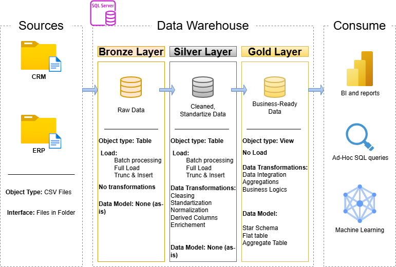

# SQL Data Warehouse & Analytics Solution

A comprehensive Data Engineering and Analytics project focused on designing and implementing a modern SQL Server data warehouse. The solution follows the Medallion Architecture approach, transforming raw ERP and CRM data into business-ready analytical datasets while delivering advanced SQL analytics, KPI reporting, customer segmentation, and product performance insights.

This project demonstrates the complete analytics lifecycle, from data ingestion and transformation to exploratory analysis, advanced analytics, and business reporting.

---

## 📊 Solution Architecture

The solution is built using a Medallion Architecture consisting of three layers:



### Bronze Layer

The Bronze layer stores source data in its original format and serves as the foundation of the warehouse.

**Responsibilities**

* Ingest ERP and CRM source files into SQL Server
* Preserve raw data without transformations
* Enable traceability back to source systems
* Support incremental data loading processes

### Silver Layer

The Silver layer focuses on data quality and integration.

**Responsibilities**

* Data cleansing and validation
* Standardization of formats and naming conventions
* Duplicate handling
* Business rule implementation
* Integration of CRM and ERP datasets

### Gold Layer

The Gold layer provides analytics-ready datasets for reporting and business intelligence.

**Responsibilities**

* Dimensional modeling using a Star Schema
* Fact and Dimension table creation
* Business KPI generation
* Reporting and analytical consumption

---

## 📌 Project Overview

This project covers the complete analytics workflow:

1. Data Warehouse Architecture Design
2. ETL Development and Data Integration
3. Data Quality Management
4. Dimensional Data Modeling
5. Exploratory Data Analysis (EDA)
6. Advanced SQL Analytics
7. Customer & Product Segmentation
8. KPI Development
9. Analytical Reporting

The final solution transforms operational sales data into actionable business insights that support data-driven decision making.

---

## 🛠️ Technologies Used

* SQL Server
* T-SQL
* SQL Server Management Studio (SSMS)
* Draw.io
* Git & GitHub

---

## 🎯 Business Requirements

### Data Warehouse Development

#### Objective

Develop a centralized SQL Server data warehouse capable of consolidating sales information from multiple operational systems into a single analytical environment.

#### Requirements

* Import ERP and CRM datasets provided as CSV files
* Resolve data quality issues during transformation
* Integrate multiple sources into a unified data model
* Support analytical workloads and reporting
* Maintain clear documentation of business entities and data structures
* Focus on the latest available dataset without historization

---

### Analytics & Reporting

#### Objective

Generate analytical outputs and business reports that help stakeholders evaluate business performance and support strategic decision-making.

#### Business Questions Addressed

* Who are the highest-value customers?
* Which products generate the most revenue?
* How do sales evolve over time?
* Which categories contribute the most to total revenue?
* How can customers be segmented according to purchasing behavior?
* Which products are high-performing and which require attention?

---

# 🔍 Exploratory Data Analysis (EDA)

Exploratory Data Analysis was conducted after the Gold Layer was created to better understand the business data and validate the analytical model.

## Database Exploration

* Reviewed database objects and metadata
* Explored table structures and column definitions
* Validated relationships between fact and dimension tables

## Dimension Exploration

### Customer Analysis

* Customer distribution by country
* Customer demographics
* Customer age distribution

### Product Analysis

* Product categories and subcategories
* Product catalog composition
* Product hierarchy validation

## Business Measures Exploration

Calculated and validated key business metrics:

* Total Sales Revenue
* Total Quantity Sold
* Average Selling Price
* Total Orders
* Total Customers
* Total Products
* Active Purchasing Customers

A consolidated KPI summary report was created using SQL aggregations.

## Magnitude Analysis

Evaluated business volume across multiple dimensions:

### Customer Analysis

* Customers by country
* Customers by gender

### Product Analysis

* Products by category
* Average cost per category

### Revenue Analysis

* Revenue by category
* Revenue by customer
* Product demand distribution across countries

## Ranking Analysis

Identified top and bottom performers using ranking techniques.

### Product Rankings

* Top 5 products by revenue
* Lowest-performing products

### Customer Rankings

* Top 10 customers by revenue
* Customers with the fewest orders

### SQL Techniques Applied

* Aggregate Functions
* GROUP BY
* JOIN Operations
* ROW_NUMBER()
* Window Functions
* Ranking Analysis

---

# 📈 Advanced Data Analytics

Advanced analytical SQL techniques were applied to uncover trends, patterns, and business opportunities.

## Change-Over-Time Analysis

Analyzed how business performance evolves across time periods.

### Metrics Analyzed

* Monthly Sales Revenue
* Customer Growth
* Product Demand
* Sales Volume

### Techniques Used

* Date Truncation
* Monthly Aggregation
* Time-Series Analysis

---

## Cumulative Analysis

Implemented running calculations to evaluate growth and long-term performance.

### Metrics

* Running Total Sales
* Year-to-Date Sales
* Moving Average Pricing

### SQL Functions

* SUM() OVER()
* AVG() OVER()
* Window Functions

---

## Performance Analysis

Compared product performance against historical benchmarks.

### Analysis Included

* Current Year Sales
* Historical Average Sales
* Previous Year Sales
* Year-over-Year Performance

### Performance Indicators

* Above Average
* Below Average
* Increasing
* Decreasing
* No Change

### SQL Functions

* LAG()
* Window Aggregations
* Common Table Expressions (CTEs)

---

## Part-to-Whole Analysis

Measured the contribution of each product category to overall sales.

### Metrics

* Category Revenue
* Revenue Share Percentage
* Category Ranking

This analysis helps identify the business areas driving overall revenue.

---

## Customer & Product Segmentation

### Product Segmentation

Products were grouped according to cost ranges:

| Segment  | Cost Range |
| -------- | ---------- |
| Budget   | Below 100  |
| Standard | 100 - 500  |
| Premium  | 500 - 1000 |
| Luxury   | Above 1000 |

### Customer Segmentation

Customers were classified based on spending behavior and purchase history.

#### VIP Customers

* Customer lifespan ≥ 12 months
* Spending > 5,000

#### Regular Customers

* Customer lifespan ≥ 12 months
* Spending ≤ 5,000

#### New Customers

* Customer lifespan < 12 months

This segmentation enables targeted business and marketing strategies.

---

# 📑 Business Reporting Layer

To provide business-ready analytical datasets, two reporting views were developed within the Gold Layer.

---

## Customer Report

### Purpose

Provides a consolidated view of customer behavior, purchasing activity, and value.

### Key Metrics

* Customer Information
* Age
* Age Group
* Customer Segment
* Total Orders
* Total Sales
* Total Quantity Purchased
* Total Products Purchased
* Customer Lifespan
* Recency
* Average Order Value (AOV)
* Average Monthly Spend

### Customer Segments

* VIP
* Regular
* New

### Age Groups

* Under 20
* 20-29
* 30-39
* 40-49
* 50+

---

## Product Report

### Purpose

Provides a complete overview of product performance and sales behavior.

### Key Metrics

* Product Name
* Category
* Subcategory
* Cost
* Total Orders
* Total Sales
* Total Quantity Sold
* Total Customers
* Product Lifespan
* Recency
* Average Order Revenue (AOR)
* Average Monthly Revenue

### Product Performance Segments

| Segment        | Revenue         |
| -------------- | --------------- |
| High Performer | > 50,000        |
| Mid Performer  | 10,000 - 50,000 |
| Low Performer  | < 10,000        |

These reporting views act as a semantic layer that can be directly consumed by BI dashboards and analytical applications.

---

## 📁 Repository Structure

```text
data-warehouse-project/
│
├── datasets/
│   └── Source ERP and CRM datasets
│
├── docs/
│   ├── architecture.png
│   ├── data_catalog.md
│   ├── data_flow.png
│   ├── data_model.png
│   └── integration_model_silver.png
│
├── scripts/
│   ├── bronze/
│   │   └── Raw data loading scripts
│   │
│   ├── silver/
│   │   └── Data cleansing and transformation scripts
│   │
│   ├── gold/
│   │   └── Dimensional model
|   |
|   ├── analysis_reporting/
│   ├── EDA.sql
│   ├── CustomerReport.sql
│   ├── DataAnalytics.sql
│   └── ProductReport.sql
│
├── README.md
├── LICENSE
└── .gitignore
```

---

## 🏆 Project Outcomes

This project successfully delivered:

* A modern SQL Server data warehouse following Medallion Architecture
* Integrated ERP and CRM data sources
* Automated ETL pipelines for data transformation
* A dimensional model optimized for analytics
* Exploratory Data Analysis (EDA)
* Advanced SQL analytical solutions
* Customer and product segmentation models
* Business KPI reporting
* Analytical reporting views ready for dashboard consumption

The result is an end-to-end analytics solution that demonstrates Data Engineering, Data Modeling, Business Intelligence, and Advanced SQL Analytics capabilities.

---

## 📄 License

This project is licensed under the MIT License. You are free to use, modify, and distribute this project for educational and portfolio purposes.
